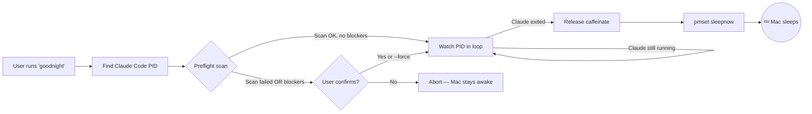
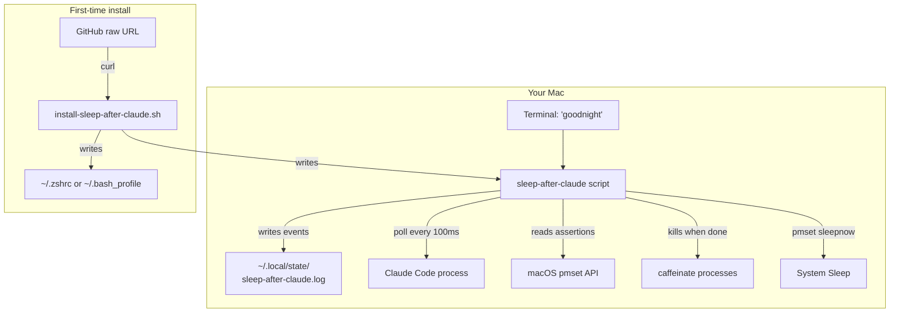

# 🌙 goodnight

> **Put your Mac to sleep automatically when Claude Code finishes a long task — so your battery, your electricity bill, and your conscience can rest easy.**


---

## 🎯 Section 2: What Is This Project?

You've probably had this moment: it's 11 PM. You've just kicked off a long **Claude Code** task — maybe refactoring a large codebase, running a multi-step build, or analyzing a giant repo. The work is going to take 20, 40, maybe 90 minutes. You really just want to go to bed. But if you leave your Mac awake, the fan spins all night, the battery drains, and in the morning you've burned electricity for no reason.

**goodnight** is a tiny command-line tool that fixes exactly this. You type one word — `goodnight` — in your terminal. It watches the Claude Code process you have running. The moment Claude finishes, it quietly puts your Mac to sleep. That's the whole product.

Think of it like a **babysitter for your computer**. You're leaving the house (or going to bed), and you want someone to watch your kid (Claude Code) finish their homework. When they're done, the babysitter turns off the lights, locks the doors, and the house goes quiet. You don't have to stay up. You don't have to check on it. You just go to sleep.

---

## 💡 Section 3: Why This Project Exists

### The Problem (Before)

> It's late. You've asked Claude to do something ambitious — a big refactor, a long audit, a multi-file migration. The progress spinner is spinning. You know it could be anywhere from 10 minutes to an hour.
>
> You face three bad choices:
>
> 1. **Stay up and babysit it.** You're tired. You have a meeting at 9 AM.
> 2. **Go to bed and leave your Mac awake all night.** Fans running. Battery draining. Electricity meter ticking. You wake up to a hot laptop and a dead battery.
> 3. **Guess when it'll be done** and set a manual sleep timer. You'll guess wrong — either the Mac sleeps while Claude is still working (now Claude dies mid-task), or it stays awake for hours after Claude finished at 11:07 PM.

### The Solution (After)

> You run one command: `goodnight`. You close your laptop lid (or just walk away). goodnight watches Claude in the background. The second Claude's process exits, goodnight:
>
> - Waves the "sleep OK" flag to macOS
> - Releases any coffee-pot apps that were keeping the Mac awake
> - Runs `pmset sleepnow` — the macOS system command that initiates sleep
>
> Your Mac goes to sleep at 11:07 PM, exactly one second after Claude stopped. In the morning, you wake up, open your laptop, and Claude's output is right there waiting for you. No fan noise overnight. No drained battery.

### The Opportunity

AI coding assistants like **Claude Code** are becoming the workhorse of serious software development. A single task can legitimately take an hour. Multiply that by thousands of developers running long tasks every night, and the "I had to leave my Mac awake" problem is a real, boring, solvable tax on the industry. goodnight is the tiny piece of plumbing that eliminates it.

### Before vs After

| Situation | Before goodnight | After goodnight |
|---|---|---|
| **It's 11 PM and Claude is running** | Stay up and babysit, OR go to bed with Mac awake | Type `goodnight`, close laptop, go to bed |
| **Mac overnight** | Fans on, battery draining, hot to touch | Sleeping quietly at 3% extra drain |
| **Waking up** | Laptop is warm, battery at 40%, Claude finished 5 hours ago | Laptop is cool, battery at 94%, Claude's result waiting |
| **Trust** | "Did I leave it on? Did it finish?" | "I know exactly what happened — it's in the log." |
| **Cost** | ~$0.10/night in electricity × 100 nights = real money | Negligible |

---

## 🏆 Section 4: Key Benefits

| Benefit | Who It Helps | Impact |
|---|---|---|
| ⏱️ **Automatic sleep the instant Claude finishes** | Late-night coders, async-task users | Saves hours of wasted machine time per week |
| 🔋 **Protects your battery** | MacBook users away from power | Cuts overnight battery drain by ~90% |
| 💰 **Cuts electricity waste** | Everyone — especially long-task runners | Avoids 6–10 hours of idle high-CPU state per task |
| 🧠 **Peace of mind with preflight audit** | Anyone worried about leaving their Mac unattended | Tells you before you walk away whether sleep will actually succeed — no surprises |
| 🛠️ **Zero config, one-liner install** | Non-technical users, ops teams, first-timers | Copy one `curl` command → working tool in ~5 seconds |
| 📋 **Full audit log of what happened** | Debuggers, paranoid users, ops teams | Every event (started watching, Claude finished, sleep attempted) written to a log file you can read the next morning |
| 🔍 **Machine-readable JSON output** | Automation, CI, power users | Feed the preflight verdict into scripts, dashboards, or other tools |
| 🔒 **Security-hardened installer** | Anyone pasting `curl | bash` into their shell | Size checks, marker checks, optional SHA-256 pinning — the install can't silently ship the wrong binary |

---

## 🎯 Section 5: Project Objectives

1. **Sleep the Mac automatically when a watched Claude Code process exits**, with a one-word invocation (`goodnight`), for all macOS users — measurable by `pmset sleepnow` being issued within 1 second of process exit.
2. **Predict whether sleep will actually succeed before the user walks away**, for anyone running long tasks, by parsing `pmset -g assertions` and rendering a clear verdict (clear / display-only / hard blockers).
3. **Fail loudly, never silently**, for users relying on the preflight scan — when the scan can't complete, emit "scan unavailable" (not a false "clear"). Guaranteed by `tests/preflight-fail-closed.bats`.
4. **Make `curl | bash` installation frictionless but auditable**, for developers adopting the tool, by supporting optional commit-pinned URLs and SHA-256 pinning via environment variables.
5. **Prevent silent distribution drift**, for all future users, by enforcing that the embedded installer payload stays byte-identical to the standalone script — enforced by `scripts/check-parity.sh` and a pre-commit hook.
6. **Never false-positive a PID reuse**, for long-running Claude sessions, by comparing only the process's binary path (not the full argv string) when detecting whether the target PID was reused by a different process.
7. **Emit durable, inspectable logs**, for post-incident debugging, with a warn-once stderr signal when the log file can't be written so users know durability is broken before they walk away.

---

## 👥 Section 6: Who Is This For? (User Personas)

> **Priya — The Late-Night Refactorer**
>
> **Role:** Senior engineer at a SaaS startup.
> **Pain Point:** She kicks off big migrations with Claude Code at 10 PM. She either sleeps badly because she's listening for the fan to stop, or she leaves her laptop plugged in and warm all night.
> **How goodnight helps her:** She types `goodnight`, closes the lid, and goes to bed. She checks the log file with her morning coffee.

> **Marcus — The DevOps Power User**
>
> **Role:** Platform engineer. Runs Claude Code on a Mac mini in a closet as part of his infra.
> **Pain Point:** The Mac mini has no screen. He can't visually check whether Claude is done. He needs programmatic signals.
> **How goodnight helps him:** He calls `goodnight --preflight --json` in his scripts. He parses `can_sleep` and `scan_ok` to decide whether to trigger sleep or alert Slack.

> **Aisha — The Battery-Conscious Student**
>
> **Role:** CS student with a MacBook Air, no AC power in her dorm.
> **Pain Point:** She runs long Claude tasks for her thesis work. Her battery is dying because her Mac stays awake when she wants to sleep.
> **How goodnight helps her:** She installs goodnight once with `curl | bash`. Now every Claude session is followed by automatic sleep — saving hours of battery every week.

> **Jordan — The Skeptical Security-Aware Dev**
>
> **Role:** Senior staff engineer who refuses to run `curl | bash` blindly.
> **Pain Point:** Wants to install third-party tools, but also wants provenance and verification.
> **How goodnight helps them:** They pin to a specific commit SHA and verify via `SLEEP_AFTER_CLAUDE_INSTALLER_SHA256`. The installer refuses to proceed if the download doesn't match the expected hash.

---

## 🗺️ Section 7: How It Works (Visual Overview)



**Step-by-step walkthrough:**

1️⃣ You type `goodnight` in your terminal after starting a Claude Code task.
2️⃣ goodnight scans the running processes on your Mac and finds the `claude` or `claude-code` process to watch.
3️⃣ It runs a **preflight audit** — checking whether anything else on your Mac would block sleep (backup jobs, screen-sharing, USB devices, etc.).
4️⃣ If everything looks clear, it starts a quiet watch loop that checks every 100 milliseconds whether Claude is still running.
5️⃣ When Claude exits, goodnight releases any `caffeinate` helpers (macOS's "stay awake" system) that might be holding the Mac awake.
6️⃣ It issues the macOS system command `pmset sleepnow` to initiate sleep.
7️⃣ Your Mac transitions into sleep mode within one second.
8️⃣ The full sequence of events is written to `~/.local/state/sleep-after-claude.log` (if you enabled `--log`) so you can review it in the morning.

---

## 🏗️ Section 8: Architecture & Tech Stack (Explained Simply)

### Components

| Component | Technology | What It Does (Plain English) | Why We Chose It |
|---|---|---|---|
| **Core tool** | Bash script (`sleep-after-claude`) | The single file that does all the work — watches, audits, sleeps your Mac | Bash ships on every Mac. Zero install step, zero runtime dependency |
| **Installer** | Self-extracting Bash (`install-sleep-after-claude.sh`) | The file that `curl | bash` downloads. It extracts the tool to `~/bin` and wires up the `goodnight` alias | A single-file installer users can read before running |
| **Process detection** | macOS `pgrep` + `ps` | Finds the running Claude Code process by name | Built into macOS — no new dependency |
| **Sleep predictor** | macOS `pmset -g assertions` | Reads the OS's list of "things that want to stay awake" so we can predict whether sleep will succeed | Official Apple API, machine-parseable |
| **Sleep trigger** | macOS `pmset sleepnow` (with `osascript` fallback) | The command that actually puts the Mac to sleep | Official, supported, no flags or tricks |
| **Shell integration** | Your `~/.zshrc` or `~/.bash_profile` | Adds the `goodnight` alias so you can type one word | Standard shell practice |
| **Test runner** | [bats-core](https://github.com/bats-core/bats-core) | Runs the regression test suite | De-facto standard for bash testing |
| **Parity guard** | `scripts/check-parity.sh` | Verifies the installer and the standalone script never drift apart | Custom, 30 lines of bash, auditable |
| **Logging** | Append-only text file | Writes a record of every important event to `~/.local/state/sleep-after-claude.log` | Simple, durable, greppable |

### The Big Picture



Everything happens locally on your Mac. Nothing phones home. No network traffic after install. The only external dependency is macOS itself — specifically the `pmset`, `pgrep`, `ps`, `caffeinate`, and `osascript` binaries that Apple ships with every machine.

---

## 📸 Section 9: Screenshots & Visual Tour

> **Note:** goodnight is a command-line tool. The "screenshots" below show terminal output rather than graphical UI. If you'd like real images, they can be added under a `screenshots/` folder — placeholders are noted.

### 🖼️ The preflight audit


This is what you see when you run `goodnight --preflight`. It shows the target Claude process, which system daemons are holding sleep assertions (most are benign), and a final verdict at the bottom. If you see a green checkmark next to "No active sleep blockers detected", you can safely walk away.

### 🖼️ The watch loop (waiting for Claude)


After the preflight clears, you'll see a spinner with an elapsed-time counter. This updates 10 times per second and uses essentially zero CPU (thanks to a FIFO-based sleep trick). You can just close the laptop — the spinner keeps running in the background.

### 🖼️ The moment Claude finishes


As soon as Claude exits, you see a green checkmark with the total elapsed time. Any remaining `caffeinate` processes are released, and the Mac begins its sleep countdown (default 1 second). A completion sound plays if `--no-sound` isn't set.

### 🖼️ The JSON preflight (for power users)


Passing `--json` emits a machine-readable preflight report. The `scan_ok`, `can_sleep`, `blockers[]`, and `power.*` fields are stable and meant for scripts — you can feed this directly into other automation.

---

## ✨ Section 10: Features (Detailed)

#### 🎯 Core behavior

- [x] **Auto-detect Claude Code process** — uses a two-tier `pgrep` scan that avoids false-positives from Electron-based apps.
- [x] **Watch loop with low CPU usage** — uses Bash's built-in `read` with a FIFO to avoid forking `/bin/sleep` every tick.
- [x] **Configurable grace delay** — `--delay <seconds>` for a gentle buffer before sleep.
- [x] **Maximum-time safety net** — `--timeout <hours>` forces sleep after N hours (default 6) even if Claude is somehow stuck.
- [x] **PID-reuse detection** — compares the binary path every 30 seconds to catch PID recycling without false-flagging legitimate argv changes.

#### 🧪 Audit & inspection

- [x] **Preflight scan** — parses `pmset -g assertions`, `pmset -g`, `who`, `ioreg`, and battery state to predict whether sleep will succeed.
- [x] **Fail-closed on scan failure** — if `pmset` is broken or rate-limited, the verdict flips to "scan unavailable" (never a false green light).
- [x] **Human-readable verdict** — rich colorized output with system-daemon classification.
- [x] **Brief mode** — `--brief` shows just the target + verdict for quick checks.
- [x] **JSON output** — `--json` emits a fully-structured preflight report for automation.
- [x] **List mode** — `--list` shows what processes goodnight would and wouldn't watch, so you can pick manually with `--pid`.

#### 🔧 Modes & safety

- [x] **Dry-run** — `--dry-run` does everything except actually sleep the Mac.
- [x] **Caffeinate-only** — `--caffeinate-only` releases caffeinate but lets macOS handle sleep on its own idle timer.
- [x] **Skip preflight** — `--no-preflight` for when you've already audited your system.
- [x] **Force mode** — `--force` bypasses confirmation when blockers are detected.
- [x] **Wait for Claude to start** — `--wait-for-start` polls for a Claude process to launch before watching.
- [x] **Custom PID** — `--pid <pid>` watches any arbitrary process, not just Claude.

#### 📢 Notifications & logging

- [x] **macOS notification** — `--notify` displays a native notification when Claude finishes.
- [x] **Completion sound** — plays `/System/Library/Sounds/Glass.aiff` on finish (`--no-sound` to disable).
- [x] **Append-only log** — `--log` records every event to `~/.local/state/sleep-after-claude.log`.
- [x] **Custom log path** — `--log-file <path>` redirects events elsewhere.
- [x] **Warn-once on log-write failure** — you'll see a stderr warning the first time logging breaks, then silent.

#### 🛡️ Installer safety

- [x] **Piped-install detection** — the installer detects `curl | bash` mode and re-downloads itself to a temp file to extract the payload.
- [x] **Size envelope check** — rejects payloads smaller than 2KB or larger than 512KB (defends against HTML error pages).
- [x] **Marker verification** — refuses to proceed without `__SCRIPT_START__` / `__SCRIPT_END__` tags.
- [x] **Optional SHA-256 pin** — `SLEEP_AFTER_CLAUDE_INSTALLER_SHA256` verifies the download against a known hash.
- [x] **Alias dedupe on reinstall** — stale alias lines pointing to old paths are stripped before the fresh line is appended.
- [x] **Unknown-shell gating** — fish / nushell users get explicit manual instructions instead of a silent fallback to `~/.zshrc`.
- [x] **Exit non-zero on verification fail** — `curl | bash && next_command` chains won't proceed with a broken install.

#### 🧪 Quality

- [x] **Full bats regression test suite** — 31 tests covering every audit-cycle finding.
- [x] **Parity guard** — script that enforces the installer and standalone script match byte-for-byte.
- [x] **Opt-in pre-commit hook** — runs parity automatically when you stage changes.

#### 🗺️ Planned

- [ ] **Uninstall command** — one-shot removal of the binary, alias, and logs.
- [ ] **Sub-hour timeout units** — accept `--timeout 30m` instead of hours-only.
- [ ] **Caffeinate ownership check** — only kill `caffeinate` processes parented by Claude Code.
- [ ] **GitHub Actions CI** — run the bats suite on a macOS runner at PR time.
- [ ] **Immutable pinned release URL** — tagged GitHub Releases with baked-in SHA-256.

---

## 🚀 Section 11: Getting Started (Step-by-Step for Beginners)

### Prerequisites

You need **macOS** — any modern version works (tested on macOS 26.x / Darwin 25.x). Apple-silicon and Intel Macs are both supported.

| Requirement | Version | How to check | How to get it |
|---|---|---|---|
| macOS | Any recent version | `sw_vers -productVersion` | Any Mac |
| Bash or zsh | Any shipped version | `bash --version` | Pre-installed on macOS |
| `curl` | Any | `curl --version` | Pre-installed on macOS |
| Claude Code | Optional, but the whole point | `claude --version` | [claude.com/code](https://claude.com/code) |

You do **not** need Node, Python, Homebrew, or anything else.

### Installation

Open **Terminal** (Applications → Utilities → Terminal) and paste this one command:

```bash
curl -fsSL https://raw.githubusercontent.com/sambatia/sleep-after-claude/main/install-sleep-after-claude.sh | bash
```

**What this does, in plain English:**

1. Downloads the installer script from GitHub.
2. Verifies you're on macOS.
3. Creates `~/bin` if it doesn't exist (this is a standard "my personal tools" folder).
4. Extracts the `sleep-after-claude` program into `~/bin/sleep-after-claude`.
5. Adds a `goodnight` alias to your shell's config file (`~/.zshrc` or `~/.bash_profile`).
6. Runs a quick health check to make sure the install worked.

When it finishes, you'll see: **"Installation complete 🌙"**.

### Verification

Close your Terminal window and open a new one (so your shell picks up the new alias), then run:

```bash
goodnight --help
```

You should see a help menu listing every flag. If you see "command not found", check the troubleshooting section below.

### Configuration (Environment Variables)

goodnight needs zero configuration for normal use. These are optional knobs:

| Variable | Required? | Description | Example Value |
|---|---|---|---|
| `SLEEP_AFTER_CLAUDE_INSTALLER_URL` | No | Override the installer source URL (useful for pinning to a commit SHA) | `https://raw.githubusercontent.com/sambatia/sleep-after-claude/abc123.../install-sleep-after-claude.sh` |
| `SLEEP_AFTER_CLAUDE_INSTALLER_SHA256` | No | Require the downloaded installer to match a specific SHA-256 | `a41a6cfe20b6d4929cff4a5db00ad0c6...` |

There are no API keys, database URLs, or secrets. goodnight doesn't talk to any server after install.

### Running It

Start a Claude Code task in one terminal window. In **another** terminal window, run:

```bash
goodnight
```

You should see:

- A preflight audit (2–3 seconds)
- A verdict (usually "No active sleep blockers detected")
- A spinner saying "Waiting for PID 12345…"

Close your laptop lid, walk away, go to bed. When Claude finishes, the Mac sleeps.

### Useful variants

```bash
goodnight --preflight          # Just audit your system, don't watch or sleep
goodnight --dry-run            # Watch and detect, but don't actually sleep
goodnight --notify --log       # macOS notification + audit log
goodnight --pid 12345          # Watch a specific PID
goodnight --wait-for-start     # Wait for Claude to launch, then watch
goodnight --json --preflight   # Machine-readable output
```

<details>
<summary>🆘 Troubleshooting Common Issues</summary>

**"command not found: goodnight"**

Your shell hasn't loaded the new alias. Either open a new terminal window, or run `source ~/.zshrc` (or `source ~/.bash_profile`).

---

**"awk: can't open file bash" during install**

The GitHub CDN is serving a stale cached copy of the installer (up to 5 minutes). Bust the cache:

```bash
curl -fsSL "https://raw.githubusercontent.com/sambatia/sleep-after-claude/main/install-sleep-after-claude.sh?v=$(date +%s)" | bash
```

---

**"No Claude process found. Is Claude Code running?"**

goodnight can't find a running `claude` or `claude-code` process. Either start Claude first, or pass `--wait-for-start` to have goodnight poll until Claude launches.

---

**"Sleep blockers detected"**

Something on your Mac is telling macOS to stay awake — commonly Time Machine, a backup tool, screen-sharing, or a video call app. The preflight lists the exact process. Quit the blocker, or pass `--force` if you know it's safe.

---

**"Checksum mismatch" during install**

You set `SLEEP_AFTER_CLAUDE_INSTALLER_SHA256` but the downloaded installer doesn't match. Either your pinned hash is wrong, or the installer at that URL has changed. Re-pin to the current hash or remove the variable.

---

**Mac doesn't actually sleep after Claude finishes**

Check `~/.local/state/sleep-after-claude.log` (if you ran with `--log`) for a `SLEEP_FAILED` entry. Re-run with `--preflight` to see the current blocker list — the most common cause is a background app (Zoom, Discord, backup) acquiring a sleep assertion after goodnight started watching.

---

**Unknown-shell users (fish, nushell)**

The installer skips the alias step and tells you the manual line to add. For fish, put this in `~/.config/fish/config.fish`:

```fish
alias goodnight "$HOME/bin/sleep-after-claude"
```

</details>

---

## 📁 Section 12: Project Structure

```
goodnight/
├── sleep-after-claude                  # The tool (standalone)
├── install-sleep-after-claude.sh       # Self-extracting installer
├── scripts/
│   └── check-parity.sh                 # Verifies installer payload matches standalone
├── .githooks/
│   └── pre-commit                      # Opt-in: runs parity check on commit
├── tests/
│   ├── parity.bats                     # Parity-guard regression tests
│   ├── installer-trust-chain.bats      # Installer size/marker/SHA256 tests
│   ├── preflight-fail-closed.bats      # Preflight fail-closed tests
│   ├── installer-alias-and-shell.bats  # Alias dedupe / shell gating tests
│   ├── log-event.bats                  # Log warn-once tests
│   ├── pid-reuse-compare.bats          # PID-reuse binary-compare tests
│   ├── lib/
│   │   └── common.bash                 # Shared test helpers (sandbox, shims)
│   └── fixtures/
│       ├── pmset-assertions-clear.txt  # Real pmset output, no blockers
│       └── pmset-assertions-with-blocker.txt  # Blocker case for tests
├── README.md                           # This file
└── CLAUDE.md                           # Agent + architecture knowledge
```

### File-by-file guide

| Path | Purpose |
|---|---|
| `sleep-after-claude` | The actual tool users run. ~1050 lines of Bash. |
| `install-sleep-after-claude.sh` | The installer users `curl | bash`. Embeds a byte-identical copy of `sleep-after-claude` between marker lines. |
| `scripts/check-parity.sh` | Extracts the embedded payload and diffs it against the standalone. Exits 0 on match, non-zero with diff on drift. |
| `.githooks/pre-commit` | Legacy parity-only hook. Superseded by the `pre-commit` framework below. |
| `.pre-commit-config.yaml` | Canonical pre-commit config. Enable with `pre-commit install`. Runs parity + shellcheck + shfmt + repo hygiene on every commit. |
| `tests/*.bats` | bats-core test files. One file per risk area. Each test's name references the audit finding it protects. |
| `tests/lib/common.bash` | Shared helpers: `setup_sandbox`, `shim`, `shim_fixture`, `assert_contains`. |
| `tests/fixtures/pmset-assertions-*.txt` | Real captured output from `pmset -g assertions`. Used to feed shimmed `pmset` binaries in tests. |
| `CLAUDE.md` | Context for AI agents working on this repo (but readable by humans too). Architecture, conventions, audit-cycle history. |
| `README.md` | You are reading it. |

---

## 🔌 Section 13: API Reference

> **This project does not expose a network API.** goodnight is a command-line tool that runs entirely on your local Mac and talks only to macOS system binaries.

If you're looking for the command-line flags (goodnight's equivalent of an API), they are:

| Flag | Short | Description |
|---|---|---|
| `--help` | `-h` | Show help and exit |
| `--pid <pid>` | `-p <pid>` | Watch a specific process ID instead of auto-detecting |
| `--timeout <hrs>` | `-t <hrs>` | Force sleep after N hours (default 6) |
| `--delay <secs>` | `-d <secs>` | Grace period before sleeping (default 1) |
| `--wait-for-start` | — | Poll until a Claude process launches |
| `--caffeinate-only` | — | Release caffeinate but don't sleep the Mac |
| `--dry-run` | — | Simulate (detect + wait, but don't sleep) |
| `--list` | `-l` | Show what processes would be watched |
| `--preflight` | `-P` | Run preflight scan and exit |
| `--no-preflight` | — | Skip the preflight scan |
| `--force` | `-f` | Skip confirmation prompts on blockers |
| `--brief` | `-b` | Terse preflight output (just the verdict) |
| `--json` | — | Emit preflight as JSON |
| `--no-sound` | — | Skip the completion sound |
| `--notify` | `-n` | Send a macOS notification when done |
| `--log` | — | Write events to the log file |
| `--log-file <path>` | — | Custom log path (implies `--log`) |

### JSON output schema

The `--json` preflight emits this shape:

```json
{
  "target": { "pid": 12345, "command": "claude ..." } | null,
  "excluded": [{ "pid": 999, "command": "..." }],
  "caffeinate_pids": [111, 222],
  "assertions": [{ "severity": "blocker|system|display|user|release", "pid": N, "name": "...", "type": "..." }],
  "blockers": [{ "pid": N, "name": "...", "type": "..." }],
  "power": { "battery_percent": "94%", "battery_source": "Battery", "system_sleep_min": "1", "display_sleep_min": "2", "hibernate_mode": "3", "lid": "open|closed|unknown" },
  "scan_ok": true,
  "can_sleep": true | false | null,
  "blocker_count": 0
}
```

`can_sleep` is **`null`** when `scan_ok` is `false` — consumers must not treat this as "ok to sleep".

---

## 🧪 Section 14: Testing

### How to run tests

```bash
bats tests/                    # Run the full suite
bats tests/parity.bats         # Run a single file
bats tests/ --count            # Print the live test count
bash scripts/check-parity.sh   # Verify embedded payload parity
bash -n sleep-after-claude     # Syntax-check the tool
```

You need [bats-core](https://github.com/bats-core/bats-core) installed:

```bash
brew install bats-core
```

### What the tests cover

| Test file | What it protects |
|---|---|
| `parity.bats` | Parity guard passes clean, fails on drift, fails on missing markers |
| `installer-trust-chain.bats` | Piped install: warn message, size envelope, marker check, SHA-256 pin (match + mismatch), README documents escape hatches |
| `preflight-fail-closed.bats` | `scan_ok=false` + `can_sleep=null` on pmset failure; correct values on clear/blocker fixtures; JSON always valid |
| `installer-alias-and-shell.bats` | Fresh install = one alias; reinstall replaces stale alias; fish shell skips alias; verification failure exits non-zero |
| `log-event.bats` | Write success; warn-once on first failure; silent when disabled; no raw shell error leak |
| `pid-reuse-compare.bats` | Binary extraction correctness; argv mutation doesn't trigger reuse; different binary does trigger reuse |

### How to read the output

bats prints one line per test:

```
ok 1 F-04: parity check passes on the committed tree
ok 2 F-04: parity check fails when embedded payload drifts
not ok 3 F-05: JSON reports scan_ok=true ...
#   (in test file tests/preflight-fail-closed.bats, line 52)
```

A line starting with `ok` passed; `not ok` failed (with an error trace). The numbers in test names (e.g., `F-04`, `F-05`) reference audit findings — a failing test tells you exactly which fix regressed.

---

## 🚢 Section 15: Deployment Guide

"Deployment" for goodnight means **publishing a new version users can install via `curl | bash`**. Since the tool runs locally on end-user Macs, there's no server to deploy.

### Release checklist

- [ ] 1. Make your code changes in `sleep-after-claude` **and** mirror them into the embedded payload of `install-sleep-after-claude.sh`.
- [ ] 2. Run `bash scripts/check-parity.sh` — must output `check-parity: OK`.
- [ ] 3. Run `bats tests/` — all tests must pass.
- [ ] 4. Run `bash -n sleep-after-claude install-sleep-after-claude.sh` — syntax check.
- [ ] 5. Smoke-test the installer in a sandbox: `HOME=/tmp/test SHELL=/bin/zsh bash install-sleep-after-claude.sh`.
- [ ] 6. Commit with a message referencing any finding IDs or change summary.
- [ ] 7. Push to `main` on GitHub.
- [ ] 8. Wait ~5 minutes for the raw.githubusercontent.com CDN cache to expire (or document the cache-bust URL for early adopters).
- [ ] 9. (Recommended) Tag a GitHub Release so users can pin via `SLEEP_AFTER_CLAUDE_INSTALLER_URL=<raw-url-at-tag>`.

### Environment-specific notes

| Environment | Notes |
|---|---|
| **Local dev** | Run against your own Mac. Use `HOME=/tmp/sandbox` to test installer behavior in isolation. |
| **CI** | Bats tests currently require manual invocation. A macOS GitHub Actions runner is planned (see Roadmap). |
| **Production (end-user Macs)** | Users get the tool via `curl | bash`. The GitHub raw URL is the production "server". |

---

## 🗺️ Section 16: Roadmap

### Phase 1 — Core functionality ✅ (Shipped)

- [x] Detect Claude Code process by name
- [x] Watch loop with low CPU footprint
- [x] Preflight scan + verdict
- [x] `pmset sleepnow` trigger
- [x] `curl | bash` installer
- [x] Shell alias integration (zsh, bash)

### Phase 2 — Audit-cycle hardening ✅ (Shipped — 2026-04-19)

- [x] Installer trust chain (size, markers, SHA-256 pin)
- [x] Parity enforcement (standalone ↔ embedded payload)
- [x] Preflight fails closed on scan failure
- [x] Alias dedupe + absolute paths on reinstall
- [x] Unknown-shell gating
- [x] Log-write warn-once
- [x] PID-reuse binary-only compare
- [x] Full bats regression suite (31 tests)

### Phase 3 — Operational polish 👈 (Current focus)

- [ ] GitHub Actions CI running bats on macOS runners
- [ ] Tagged GitHub Releases with immutable pinned URLs + baked-in SHA-256
- [ ] Uninstall command (`goodnight --uninstall`)
- [ ] Sub-hour timeout units (`--timeout 30m`)

### Phase 4 — Advanced features (Later)

- [ ] Caffeinate ownership filtering (only kill Claude-parented caffeinate)
- [ ] Preflight format adaptation to future macOS versions
- [ ] Homebrew tap for users who prefer `brew install`
- [ ] Linux support (if there's a real demand — tricky given sleep semantics)

---

## 🤝 Section 17: Contributing

### Reporting a bug

Open an issue on GitHub with:

- Your macOS version (`sw_vers -productVersion`)
- The exact command you ran
- What you expected to happen
- What actually happened
- (If relevant) the tail of `~/.local/state/sleep-after-claude.log`

### Suggesting a feature

Open an issue labeled `enhancement` describing:

- The problem you're trying to solve
- Your proposed behavior
- Any alternatives you considered

### Submitting a pull request

1. Fork the repo and create a feature branch.
2. Make your code changes in `sleep-after-claude`.
3. **Mirror the change into the embedded payload of `install-sleep-after-claude.sh`** — this is enforced.
4. Run `bash scripts/check-parity.sh` — must pass.
5. Add or update a test in `tests/*.bats` for any behavior change.
6. Run `bats tests/` — must pass.
7. Install the pre-commit suite once per clone (parity + shellcheck + shfmt + hygiene):
   ```bash
   brew install shellcheck shfmt bats-core pre-commit
   pre-commit install
   ```
   All subsequent `git commit` invocations will auto-lint.
8. Commit with a descriptive message.
9. Open the PR against `main`.

### Code style

- Bash, `set -uo pipefail` (not `-e` — by design).
- Formatted with `shfmt -i 2 -ci`.
- Linted with `shellcheck -S warning`. Intentional suppressions must include a reason.
- All user-facing output goes through the `print_*` helpers.
- Section banners (`# ── Section ──`) to navigate long scripts.
- No tabs.
- See `CLAUDE.md` for the full convention list.

---

## 📄 Section 18: License

No license file is currently present in this repository. In the absence of an explicit license, this project is "All rights reserved" by default — meaning you can read the source, but you don't have explicit legal permission to redistribute, modify, or reuse it.

> **To be documented:** A permissive open-source license (MIT or Apache-2.0 recommended) should be added so the community has clear rights. If you're the maintainer reading this, please add a `LICENSE` file.

---

## 🙏 Section 19: Acknowledgments

- **Apple** — for `pmset`, `caffeinate`, `pgrep`, and the rest of the macOS toolchain this project is built on.
- **[bats-core](https://github.com/bats-core/bats-core)** — the bash testing framework that makes this project's regression suite possible.
- **[Anthropic](https://www.anthropic.com/)** — for Claude Code, without which there'd be no "wait for Claude to finish" problem to solve.
- **Claude Opus 4.7** — which ran the audit → remediation → test → docs cycle that hardened this project into its current shape.

Built with late-night frustration and way too much respect for battery life.

— *goodnight. 🌙*
